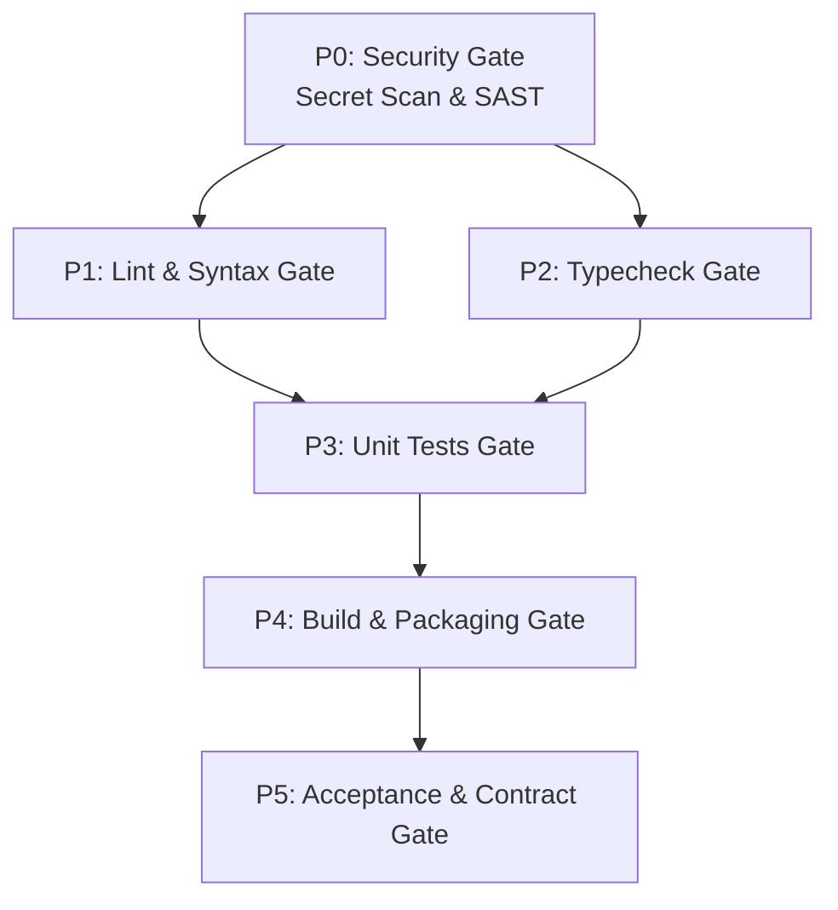

# Omni v4: Vendor-Neutral Reliability Harness for Coding Agents

[](https://www.typescriptlang.org/)
[](https://nodejs.org/)
[](https://zod.dev/)
[](#-h%E1%BB%87-th%E1%BB%91ng-quality-gates--dag-scheduler)
[](#2-state-machine--append-only-event-store)

> **Omni v4** là thế hệ tiếp theo của Omni-Coder Kit, được tái cấu trúc hoàn toàn bằng **TypeScript**. V4 không thay thế năng lực lập trình hay subagent bản địa của các AI Agent (Codex, Claude Code, Antigravity), mà đóng vai trò là một **Reliability Harness cục bộ (local-first)** — điều phối các tác vụ kỹ thuật thông qua State Machine tất định, thực thi chính sách an toàn nghiêm ngặt, lưu vết trạng thái bền vững và yêu cầu bằng chứng thực nghiệm (verifiable evidence) trước khi phê duyệt hoàn thành.

---

## 📑 Mục lục

- [1. Tầm nhìn & Nguyên lý Thiết kế cốt lõi](#1-t%E1%BA%A7m-nh%C3%ACn--nguy%C3%AAn-l%C3%BD-thi%E1%BA%BFt-k%E1%BA%BF-c%E1%BB%91t-l%C3%B5i)
- [2. Sơ đồ Kiến trúc Tổng thể (Architecture Data Flow)](#2-s%C6%A1-%C4%91%E1%BB%93-ki%E1%BA%BFn-tr%C3%BAc-t%E1%BB%95ng-th%E1%BB%83)
- [3. So sánh Toàn diện: Omni v3 vs Omni v4](#3-so-s%C3%A1nh-to%C3%A0n-di%E1%BB%87n-omni-v3-vs-omni-v4)
- [4. Chi tiết các Phân hệ Cốt lõi trong v4](#4-chi-ti%E1%BA%BFt-c%C3%A1c-ph%C3%A2n-h%E1%BB%87-c%E1%BB%91t-l%C3%B5i-trong-v4)
  - [4.1 Contracts & Zod Schemas (`src/v4/contracts/`)](#41-contracts--zod-schemas)
  - [4.2 Deterministic State Machine & Replay Engine (`src/v4/core/`)](#42-deterministic-state-machine--replay-engine)
  - [4.3 Append-Only Event Store & Artifact Storage (`src/v4/storage/`)](#43-append-only-event-store--artifact-storage)
  - [4.4 Fail-Closed Policy Engine & Budget Policy (`src/v4/policy/`, `src/v4/metrics/`)](#44-fail-closed-policy-engine--budget-policy)
  - [4.5 Bộ Adapter Đa Agent (`src/v4/adapters/`)](#45-b%E1%BB%99-adapter-%C4%91a-agent)
  - [4.6 Quality Gates & DAG Scheduler (`src/v4/quality/`)](#46-quality-gates--dag-scheduler)
  - [4.7 Evidence Bundle Store (`src/v4/quality/evidence-bundle-store.ts`)](#47-evidence-bundle-store)
  - [4.8 Acceptance Engine & Bounded Repair Loop (`src/v4/quality/`)](#48-acceptance-engine--bounded-repair-loop)
  - [4.9 Benchmark Suite & Compatibility Probes (`src/v4/benchmark/`, `src/v4/compatibility/`)](#49-benchmark-suite--compatibility-probes)
- [5. Hướng dẫn Lập trình với TypeScript API](#5-h%C6%B0%E1%BB%9Bng-d%E1%BA%ABn-l%E1%BA%ADp-tr%C3%ACnh-v%E1%BB%9Bi-typescript-api)
- [6. Build, Typecheck, Test & Benchmark Commands](#6-build-typecheck-test--benchmark-commands)
- [7. Trạng thái Triển khai (Milestones Status)](#7-tr%E1%BA%A1ng-th%C3%A1i-tri%E1%BB%83n-khai)

---

## 1. Tầm nhìn & Nguyên lý Thiết kế cốt lõi

Omni v4 được xây dựng dựa trên 6 nguyên lý kỹ thuật bất biến:

1. **Observable (Quan sát minh bạch):** Mọi hành động, quyết định chuyển trạng thái, câu lệnh chạy và kết quả adapter đều được ghi lại dưới dạng sự kiện có cấu trúc vào Append-Only Event Store.
2. **Resumable (Khả năng phục hồi tất định):** Khi tiến trình bị crash, timeout hoặc mất mạng, v4 tái tạo trạng thái hoàn chỉnh bằng cách replay event log từ đĩa, không bao giờ lặp lại các tác vụ phá hủy (destructive actions).
3. **Verifiable (Dựa trên bằng chứng thực nghiệm):** Không bao giờ chấp nhận "lời văn tự nhận thành công" của mô hình LLM. Thành công bắt buộc phải có Evidence Bundle (mã thoát lệnh = 0, digest đầu ra, SHA-256 artifact hash).
4. **Safe by Default (Mặc định an toàn tuyệt đối):** Quyền thao tác chỉ ở mức `read-only` hoặc `workspace-write` cục bộ. Mọi thao tác can thiệp hệ thống (`elevated`) hoặc mutation bên ngoài đều yêu cầu opt-in rõ ràng từ người dùng.
5. **Vendor-Neutral (Trung lập giữa các hãng AI):** Cung cấp chung một mô hình chính sách, state machine và quality gates cho cả Codex (OpenAI), Claude Code (Anthropic), và Antigravity (Google DeepMind).
6. **Local-First (Vận hành cục bộ 100%):** Không phụ thuộc vào bất kỳ Cloud Control Plane, SaaS Backend hay Skill Marketplace độc quyền nào.

---

## 2. Sơ đồ Kiến trúc Tổng thể

```mermaid
flowchart TD
    subgraph CLI_API [Giao diện Tương tác]
        CLI[Omni v4 CLI / API]
        CompatProbe[Host Compatibility Probe]
    end

    subgraph CoreEngine [Hạt nhân Điều phối (Reliability Kernel)]
        Orchestrator[RunOrchestrator]
        Controller[RunController]
        StateMachine[Deterministic State Machine & Transitions]
        Policy[Policy Engine & Budget Controller]
    end

    subgraph StorageLayer [Lớp Lưu trữ Bền vững]
        EventStore[(Append-Only Event Store<br/>events.ndjson)]
        ArtifactStore[(File Artifact Store<br/>SHA-256 Verified)]
    end

    subgraph AdaptersLayer [Lớp Adapter Đa Agent]
        Registry[Adapter Registry]
        Codex[Codex Adapter]
        Claude[Claude Code Adapter]
        Agy[Antigravity Adapter]
        ProcRunner[Node Process Runner<br/>Verbatim Args & Sandbox]
    end

    subgraph QualityAcceptance [Phân hệ Chất lượng & Nghiệm thu]
        Coordinator[Quality Coordinator]
        DAGScheduler[DAG Gate Scheduler]
        GateRunner[Gate Runner<br/>Secret Redaction & Digesting]
        EvidenceStore[(Evidence Bundle Store<br/>evidence.json)]
        Acceptance[Acceptance Engine]
        Judge[Agent-as-Judge]
        RepairPolicy[Bounded Repair Policy]
    end

    CLI --> Orchestrator
    CompatProbe --> Registry
    Orchestrator --> Controller
    Controller --> Policy
    Controller --> StateMachine
    Controller --> EventStore
    Controller --> ArtifactStore
    Controller --> Registry

    Registry --> Codex
    Registry --> Claude
    Registry --> Agy
    Codex & Claude & Agy --> ProcRunner

    Orchestrator --> Coordinator
    Coordinator --> DAGScheduler
    DAGScheduler --> GateRunner
    GateRunner --> EvidenceStore
    Coordinator --> Acceptance
    Acceptance --> Judge
    Acceptance --> RepairPolicy
    Coordinator --> EventStore
```

---

## 3. So sánh Toàn diện: Omni v3 vs Omni v4

| Tiêu chí | Omni v3 (v3.0.0) | Omni v4 (Next-Gen) |
| :--- | :--- | :--- |
| **Ngôn ngữ & Runtime** | JavaScript CommonJS (Node.js 20+) | TypeScript 5.9 strict, Node.js 20+ Native ESM/CJS |
| **Mô hình Trạng thái (State Model)** | File trạng thái cục bộ `state.json` ghi đè | **Append-Only Event Store** (`events.ndjson`) + Replay Reducer |
| **Độ tin cậy khi Phục hồi (Recovery)** | Đọc snapshot gần nhất, rủi ro mất đồng bộ khi crash giữa chừng | **Event Sourced Reconstitution**: Replay log, khôi phục trạng thái chuẩn xác 100% |
| **Cơ chế Quality Gates** | Tuần tự P0–P5 qua script shell | **DAG Gate Scheduler**: Chạy song song các gate read-only, khóa ghi tuần tự, tỉa nhánh lỗi sớm |
| **Bằng chứng Nghiệm thu (Evidence)** | Báo cáo markdown do LLM sinh ra | **Cryptographic Evidence Bundle**: SHA-256 checksums, exit code, execution traces |
| **Hỗ trợ Agent** | Codex + Gemini (Dual Mode) + Rules IDE | **Vendor-Neutral First-Class Adapters**: Codex, Claude Code, Antigravity (`agy`) |
| **Chính sách Quyền hạn (Permissions)** | Cấu hình flag qua CLI (`--yolo`) | **Fine-grained Policy Engine**: `read-only`, `workspace-write`, `elevated` |
| **Khả năng Chống Ảo tưởng (Anti-Hallucination)** | Quy trình SDLC & Prompt templates | **Fail-Closed Engine**: Chặn tuyệt đối `prose-only success`, bắt buộc xác thực artifact & exit codes |
| **Đánh giá Benchmark** | Manual testing & bash script | **Automated Benchmark Harness**: Manifest-driven, auto scoring, Markdown/JSON reports |

---

## 4. Chi tiết các Phân hệ Cốt lõi trong v4

### 4.1 Contracts & Zod Schemas

Toàn bộ dữ liệu giao tiếp giữa các phân hệ được định nghĩa bằng **Zod Schemas** nghiêm ngặt tại `src/v4/contracts/`:

```
src/v4/contracts/
├── ids.ts            # Type-safe ID generators: RunId, StepId, GateId, ArtifactId, AttemptId...
├── event.ts          # RunEventSchema (20+ typed events: run.started, step.succeeded, gate.settled...)
├── artifact.ts       # ArtifactClaimSchema & ArtifactRecordSchema (SHA-256 digests, path validation)
├── evidence.ts       # EvidenceRecordSchema (redacted commands, exit codes, output digests)
├── step-result.ts    # StepResultSchema (succeeded, failed, blocked, cancelled)
├── quality.ts        # GateDefinitionSchema, GateResultSchema (4-state: passed/failed/skipped/inconclusive)
├── policy.ts         # PolicyConfigSchema, PermissionMode, retry/budget constraints
├── run.ts            # RunStateSchema, RunPhase, FailureTaxonomy
└── adapter.ts        # HostProbeSchema, AdapterCapabilities, AdapterContract
```

*Đặc tính cốt lõi:* Cấm hoàn toàn đường dẫn tương đối trỏ ra ngoài (`..`) hoặc đường dẫn tuyệt đối trái phép trong `ArtifactClaimSchema`.

---

### 4.2 Deterministic State Machine & Replay Engine

State Machine của v4 quản lý vòng đời 7 pha (`RunPhase`):

```text
       ┌──────────┐
       │  INTAKE  │
       └────┬─────┘
            ▼
       ┌──────────┐
       │   PLAN   │
       └────┬─────┘
            ▼
       ┌──────────┐ ◄────── [Repair Loop] ──────┐
       │ EXECUTE  │                             │
       └────┬─────┘                             │
            ▼                                   │
       ┌──────────┐                             │
       │  VERIFY  │ ─── [Gate Failed] ──────────┤
       └────┬─────┘                             │
            ▼                                   │
       ┌──────────┐                             │
       │  ACCEPT  │ ─── [Requirement Failed] ───┘
       └────┬─────┘
            ▼
       ┌──────────┐
       │ DOCUMENT │
       └────┬─────┘
            ▼
       ┌──────────┐
       │  READY   │ (Handoff hoàn tất, sẵn sàng release)
       └──────────┘
```

- **`reduceEvent(state, event)`**: Hàm thuần túy (pure reducer), cập nhật trạng thái chỉ dựa trên sự kiện hợp lệ, kiểm tra thứ tự tuần tự `sequenceNumber` tăng đơn điệu.
- **`nextPhaseOnSuccess(phase)`**: Điều phối chuyển pha theo ma trận chuyển tiếp chuẩn.
- **`recoverRun(eventStore, runId)`**: Đọc lại toàn bộ file `events.ndjson` từ đĩa để dựng lại `RunState`. Nếu một bước ghi đang chạy dở (`inFlight`) lúc crash, hệ thống sẽ chuyển về `BLOCKED` an toàn mà không tự ý ghi lại vào ổ đĩa.

---

### 4.3 Append-Only Event Store & Artifact Storage

- **`FileEventStore` (`src/v4/storage/event-store.ts`):**
  - Ghi sự kiện theo định dạng NDJSON (Newline Delimited JSON).
  - Tích hợp kiểm tra xung đột chuỗi sự kiện (`EventSequenceConflictError`) và phát hiện dữ liệu hỏng (`CorruptEventLogError`).
  - Hỗ trợ replay luồng sự kiện để kiểm toán hoặc audit.
- **`FileArtifactStore` (`src/v4/storage/artifact-store.ts`):**
  - Lưu trữ artifact kèm băm SHA-256.
  - Tự động kiểm tra tính nguyên vẹn: so khớp băm khi đọc lại để phát hiện kịp thời các can thiệp bên ngoài.

---

### 4.4 Fail-Closed Policy Engine & Budget Policy

- **`DefaultPolicy` (`src/v4/policy/default-policy.ts`):**
  - Kiểm tra điều kiện tiên quyết (Preflight): Xác nhận agent được chọn có đủ `capabilities` (ví dụ: `workspace_edit`, `shell_execution`) cho tác vụ yêu cầu.
  - Phân loại lỗi (`classifyFailure`): Nhận diện lỗi mạng/tạm thời (cho phép retry) vs lỗi logic/cấu hình (chuyển sang `BLOCKED` để tránh lãng phí token).
- **`BudgetPolicy` (`src/v4/metrics/budget-policy.ts`):**
  - Giám sát thời gian thực: Giới hạn token đầu vào/đầu ra, chi phí ước tính (USD), số lần retry và thời gian chạy tối đa.
  - Tự động ngắt khi phát hiện dấu hiệu vòng lặp vô tận hoặc vượt ngân sách cho phép.

---

### 4.5 Bộ Adapter Đa Agent

Các adapter được chuẩn hóa qua `AdapterContract` và kiểm tra bởi chung một bộ Contract Test Suite:

```
src/v4/adapters/
├── codex/          # Adapter cho OpenAI Codex CLI (--json, --sandbox, --output-schema)
├── claude/         # Adapter cho Anthropic Claude Code CLI (--print, --output-format json, tool policies)
├── antigravity/    # Adapter cho Google Antigravity CLI agy (--json-schema, --sandbox, timeout-guards)
└── registry.ts     # Adapter Factory & Dynamic Host Probing
```

- **An toàn Process (`NodeProcessRunner`):** Thực thi tiến trình con trực tiếp qua `argv` (không dùng shell parsing) nhằm loại bỏ rủi ro Shell Injection trên cả Windows, Linux và macOS.
- **Output Parsing Chuẩn mực:** Trích xuất kết quả có cấu trúc, mã thoát lệnh, và native metadata sử dụng Zod schema validation.

---

### 4.6 Quality Gates & DAG Scheduler

Hệ thống kiểm định chất lượng trong v4 hoạt động theo mô hình **Directed Acyclic Graph (DAG)**:



- **Song song hóa tối ưu:** Các gate chỉ đọc (read-only) độc lập được chạy song song (mặc định concurrency = 2).
- **Khóa độc quyền (Workspace-Write Lock):** Các gate có khả năng thay đổi mã nguồn hoặc build artifact được khóa chạy tuần tự.
- **Ngữ nghĩa 4 trạng thái:** `passed`, `failed`, `skipped`, `inconclusive`. Bất kỳ gate bắt buộc nào bị `inconclusive` sẽ **fail-closed** ngay lập tức.
- **Secret Redaction:** Tự động lọc sạch các API keys, token hoặc biến môi trường nhạy cảm trong logs trước khi xuất bằng chứng.

---

### 4.7 Evidence Bundle Store

`EvidenceBundleStore` (`src/v4/quality/evidence-bundle-store.ts`) lưu trữ toàn bộ bằng chứng kiểm thử thành gói dữ liệu bất biến:

```json
{
  "bundleId": "eb-20260828-9fa8b12c",
  "runId": "run-01HXYZ7890ABCDEF",
  "phase": "VERIFY",
  "createdAt": "2026-08-28T12:00:00.000Z",
  "records": [
    {
      "gateId": "gate-test-unit",
      "command": "npm test",
      "exitCode": 0,
      "durationMs": 4200,
      "outputDigest": "sha256:e3b0c44298fc1c149afbf4c8996fb92427ae41e4649b934ca495991b7852b855",
      "verdict": "passed"
    }
  ],
  "artifactHashes": {
    "dist/index.js": "sha256:a1b2c3d4..."
  },
  "bundleChecksum": "sha256:9f8e7d6c..."
}
```

---

### 4.8 Acceptance Engine & Bounded Repair Loop

- **`AcceptanceEngine`:** Đọc danh sách yêu cầu nguyên tử từ `.omni/sdlc/requirements.md` (hiện tại R1-R98) và đối chiếu từng mục với bằng chứng thực nghiệm thu thập được.
- **`AgentJudge`:** Dành cho các yêu cầu phi chức năng hoặc trải nghiệm giao diện. Bắt buộc mô hình phải đưa ra `rationale` phân tích chi tiết trước khi chấm `satisfied`.
- **`RepairPolicy`:**
  - Giới hạn số chu kỳ sửa lỗi tối đa (mặc định: 2 chu kỳ).
  - Tự động phát hiện trạng thái "dậm chân tại chỗ" (Stagnation Detection): Nếu 2 lần sửa liên tiếp gặp cùng một lỗi mà không tạo ra tiến triển về test pass, hệ thống sẽ dừng lại và chuyển sang trạng thái `BLOCKED` để người dùng hỗ trợ.

---

### 4.9 Benchmark Suite & Compatibility Probes

- **Benchmark Runner (`src/v4/benchmark/`):**
  - Chạy bộ bài kiểm chuẩn đại diện (`benchmarks/v4/manifest.json`).
  - Tách `expectation match` khỏi Reliable Completion Rate. Một completion chỉ đáng tin khi tạo working result, qua mandatory gates, đạt acceptance, có evidence đầy đủ và không false-success.
  - Aggregate dùng denominator là các task thật sự applicable; không có task applicable thì SLO là `inconclusive`, không phải 100%.
  - Performance/context profile giữ metric thiếu ở trạng thái `unavailable`, không tự ghi thành 0. V3/v4 comparison bắt buộc cùng corpus identity và correctness được xét trước speed/token.
  - Tự động xuất báo cáo định dạng Markdown và JSON.
- **Host Compatibility Matrix (`compatibility/v4/hosts.json`):**
  - Lưu trữ danh sách các phiên bản CLI đã được kiểm chứng (Codex `0.150.1`, Claude Code `2.1.185`, Antigravity `1.1.16`).
  - Probes kiểm tra thời gian thực các cờ CLI bắt buộc trước khi kích hoạt adapter.

### 4.10 Migration và Compatibility Smoke Evidence

- Trong checkout v4, `node scripts/run-v4-migration.cjs --project <path> --id <id>` chỉ tạo deterministic dry-run plan và không ghi source. Command này chưa thuộc npm package v3.1.0.
- Thêm `--apply` để tạo checksum-backed backup rồi mới ghi v4 legacy-import record. Rollback dùng `--rollback <backup-manifest.json>` và từ chối backup bị tamper.
- Compatibility smoke yêu cầu đồng thời manifest opt-in, environment opt-in và runner approval. Evidence JSON/Markdown được ghi theo ngày; promotion validation chỉ trả plan và không tự sửa `hosts.json`.
- External Gate 2/3 vẫn disabled trong manifest. Runtime activation cần clean pinned Git binding và paid-model approval riêng; deterministic tests không được dùng để tuyên bố live qualification.

---

## 5. Hướng dẫn Lập trình với TypeScript API

### 1. Khởi tạo Orchestrator và Chạy một tác vụ

```typescript
import {
  RunOrchestrator,
  FileEventStore,
  FileArtifactStore,
  DefaultPolicy,
  createAdapter,
  QualityCoordinator,
  GateRegistry,
  GateRunner,
  GateScheduler,
  EvidenceBundleStore,
  AcceptanceEngine,
  AgentJudge,
  RepairPolicy,
  NodeProcessRunner,
} from "omni-coder-kit";

// 1. Khởi tạo storage và process runner
const workspaceRoot = process.cwd();
const processRunner = new NodeProcessRunner();
const eventStore = new FileEventStore(workspaceRoot);
const artifactStore = new FileArtifactStore(workspaceRoot);

// 2. Khởi tạo adapter cho agent (Codex / Claude / Antigravity)
const adapter = createAdapter("codex", {
  processRunner,
  workspaceRoot,
  permissionMode: "workspace-write",
});

// 3. Thiết lập Quality Engine & Gate Scheduler
const gateRegistry = new GateRegistry();
const gateRunner = new GateRunner({ processRunner, workspaceRoot });
const gateScheduler = new GateScheduler({ maxParallelism: 2 });
const evidenceStore = new EvidenceBundleStore({ workspaceRoot });
const acceptanceEngine = new AcceptanceEngine({
  judge: new AgentJudge({ adapter }),
});
const repairPolicy = new RepairPolicy({ maxRetries: 2 });

const qualityCoordinator = new QualityCoordinator({
  gateRegistry,
  gateRunner,
  gateScheduler,
  evidenceStore,
  acceptanceEngine,
  repairPolicy,
  eventStore,
});

// 4. Khởi chạy toàn bộ quy trình qua RunOrchestrator
const orchestrator = new RunOrchestrator({
  eventStore,
  artifactStore,
  policy: new DefaultPolicy(),
  adapter,
  qualityCoordinator,
});

const result = await orchestrator.executeRun({
  specFilePath: ".omni/sdlc/requirements.md",
  phase: "INTAKE",
});

console.log("Kết quả thực thi:", result.status);
```

---

## 6. Build, Typecheck, Test & Benchmark Commands

Omni v4 tích hợp đầy đủ các script kiểm định tự động tương thích 100% với Windows PowerShell, macOS và Linux:

```bash
# 1. Kiểm tra kiểu dữ liệu tĩnh (TypeScript strict mode)
npm run typecheck:v4

# 2. Biên dịch TypeScript sang CommonJS trong thư mục dist-v4/
npm run build:v4

# 3. Chạy toàn bộ 43 bộ kiểm thử tự động của v4
npm run test:v4

# 4. Chạy bộ Benchmark tiêu chuẩn
npm run benchmark:v4

# 5. Chạy toàn bộ test suites (cả v3 và v4)
npm test
```

---

## 7. Trạng thái Triển khai

Omni v4 được phát triển theo lộ trình 12 tháng với các cột mốc kiểm định nghiêm ngặt:

- [x] **Milestone 0 & P0:** Contracts, Zod Schemas, Append-Only Event Store, Deterministic State Machine, Crash Recovery.
- [x] **Milestone 1 & P1:** First-Class Adapters (Codex, Claude Code, Antigravity `agy`), Safe Process Runner, Contract Test Suite.
- [x] **Milestone 2 & P2:** DAG Quality Gate Scheduler, 4-State Gate Semantics, Secret Redaction, SHA-256 Evidence Bundle Store.
- [x] **Milestone 3 & P3:** Acceptance Engine, Agent-as-Judge, Bounded Repair Policy, Automated Benchmark Runner, 100% Traceability (R1–R79).
- [ ] **Milestone 4 & P4 (Đang phát triển):** CLI Commands Integration, Live Smoke Benchmarks, Packaging & Final Documentation.

---

## 📄 Giấy phép

Mã nguồn Omni v4 được phân phối theo giấy phép **ISC**.
Phát triển và duy trì bởi **TAV** (<tav99.dev@gmail.com>).
